

Kathleen De Ridder Student,\_  Western Governors University 11/7/2022

Section A  2	

## Table of Contents

2

[**SECTION** **A**	**3**](#_toc_250029)

[Letter of Transmittal	3](#_toc_250028)

[Project Recommendation	4](#_toc_250027)

1. [*Problem* *Summary*	*4*](#_toc_250026)
1. [*Application* *Benefits*	*4*](#_toc_250025)
1. [*Application* *Description*	*4*](#_toc_250024)
1. [*Data* *Description*	*6*](#_toc_250023)
1. [*Objective* *and* *Hypotheses*	*6*](#_toc_250022)
1. *Methodology*	*7*
1. *Funding* *Requirements*	*7*
1. *Stakeholders’* *Impact*	*7*
1. [*Data* *Precautions*	*8*](#_toc_250021)
1. [*Developer’s* *Expertise*	*8*](#_toc_250020)

[**SECTION** **B**	**9**](#_toc_250019)

1. [*Problem* *Statement*	*9*](#_toc_250018)
1. [*Customer* *Summary*	*9*](#_toc_250017)
1. [*Existing* *System* *Analysis*	*9*](#_toc_250016)
1. [*Data*	*9*](#_toc_250015)
1. [*Project* *Methodology*	*11*](#_toc_250014)
1. [*Project* *Outcomes*	*12*](#_toc_250013)
1. [*Implementation* *Plan*	*13*](#_toc_250012)
1. [*Evaluation* *Plan*	*14*](#_toc_250011)
1. [*Resources* *and* *Costs*	*15*](#_toc_250010)
1. *Timeline* *and* *Milestones*	*16*

[**SECTION** **D**	**18**](#_toc_250009)

1. [*Project* *Purpose*	*18*](#_toc_250008)
1. [*Datasets*	*18*](#_toc_250007)
1. [*Data* *Product* *Code*	*24*](#_toc_250006)
   1. Model training notebook	24

Setting up the environment and reading the data	24

Preprocessing the data	28

Training the models	29

Comparing the models	33

1. Visualization notebook	36

Setting up the environment and loading up the data.	36

Visualization 1: Bar plot of images per species	40

Visualization 2: Scatter plot of images per family	41

Visualization 3: 3D Scatter plot of average RGB values	43

Making predictions	45

1. User Interface notebook	49

Setting up the application	49

Classify Button	52

Dataset Visuals Button	56

Interactive Visual Button	59

Voila	62

Heroku	62

1. *Hypothesis* *verification*	*63*
1. [*Effective* *Visualizations* *and* *Reporting*	*64*](#_toc_250005)
1. [*Accuracy* *analysis*	*67*](#_toc_250004)
1. *Application* *Testing*	*69*
1. *Security* *Measures* *and* *Maintenance*	*71*
1. *Application* *Files*	*72*
1. [*User’s* *Guide*	*74*](#_toc_250003)
1. [*Summation* *of* *Learning* *Experience*	*74*](#_toc_250002)

[**SECTION** **E**	**75**](#_toc_250001)

[Citations	75](#_toc_250000)

Section A  3	

## Section A
### Letter of Transmittal

, CO,
November 7th, 2022 Kathleen De Ridder

OR,

Dear

Subject: Web Application proposal for bird identification.

Many people enjoy watching birds in their backyards, but they don’t always know which birds they are looking at, or what the best way is to make their backyards more inviting to them.	is always looking for more ways to engage the general public in the protection and preservation of nature in their surroundings. The first step in this process is to educate people about the birds they share their environment with.

Creating an easy-to-use, easy-to-access tool that allows people to quickly and reliably identify the species of birds in their environment will engage the people with nature around them and can spark an interest in making their backyards more hospital for them. By making nature more recognizable, they will feel more involved and connected to it.

To this end, we propose a web application, accessible through their web browser, that allows a user to upload a picture they have taken of a bird they have seen. The machine learning algorithm powering the application will be able to accurately recognize which bird is depicted in the image. Once the user knows who is visiting their backyards, they can easily find the right ways to make their yards a better place for the birds, by offering them appropriate bird seeds or providing the right-sized birdhouses.

The application we propose will cost an estimated $34,320 to develop. There will not be any need to acquire new hardware for this project. My experience developing multiple web application projects, and several machine learning solutions, qualifies me to successfully complete this project.

If you have any further questions about this proposal, please do not hesitate to contact me.

Sincerely,

Kathleen De Ridder

3

Section A  4	

### Project Recommendation
1. ##### Problem Summary
is a non-profit organization that aims to increase awareness and involvement of the general public in the preservation of nature found in the public’s own neighborhoods. In urban or suburban settings, it is often easy for people to miss or ignore the fauna and flora that are integrated into their environment and neighborhood.	wants to bring attention to these pockets of nature that are found all around us, in an effort to inspire people to preserve these species and their habitats and to coexist with nature around them.

wants to create a tool that allows anybody to identify the birds they see around them, simply by uploading a photo to a web application. By creating an easy-to-use application, the user can get more informed about what lives around their homes, encouraging them to make their backyards more hospitable for birds around them.

1. ##### Application Benefits
By offering users a user-friendly web application, anyone who is interested in the bird population around them can easily get more informed about what species of birds live in their own backyards, without having to manually identify the birds they see. The application will swiftly and accurately predict which bird the user photographed, allowing them to research how to make their environment more welcoming to these birds, for example by hanging out bird feeders with appropriate bird seeds, or by installing birdhouses with the right-sized holes. This awareness of which bird species live in their own neighborhoods can spark an interest in nature around them, and a desire to preserve the species and their habitats.

1. ##### Application Description
The proposed data solution will be a web-based application, hosted on Heroku. The user will be able to access this application in their web browser. Heroku is a Platform as a Service (PaaS) cloud service that allows easy deployment of applications (Heroku, 2022).

The code for the application will be written in python 3, using Jupyter notebooks, and will be visualized with the Voila extension for Jupyter notebooks. The notebooks will use several libraries such as pandas, NumPy, matplotlib, and TensorFlow.

The application will be powered by the convolutional neural network (CNN) called MobileNet V3. This model has been pre-trained on the very large (1.4M) ImageNet dataset (ILSVRC-2012-CLS (Russakovsky et al., 2015)) to be able to recognize images of all kinds. Other CNNs (such as ResNet and EfficientNet) will be explored and compared to MobileNet in terms of accuracy, precision, recall, and size, to verify that this model is the best solution for the application.

Through transfer learning, we will train this model on the bird dataset, so that it will be able to accurately (> 90%) classify birds into 450 different species. We will utilize three different notebooks. The first one will be used to train the model, using the TensorFlow, TensorFlow-hub, and Keras libraries. The

4

Section A  5	

second notebook will create the data visualizations, relying heavily on the matplotlib library. The model and the visualizations will be combined in a third notebook that creates the user interface, using Voila.

The dataset we will use for the training is a public dataset from Kaggle (Piosenka, 2022), containing 75,000 images of birds spread over 450 species and split into a training set, a testing set, and a validation set.

Then the web application will use the trained model to accurately predict the bird in the picture uploaded by the user. The user will be presented with the top 3 predictions and their probabilities.

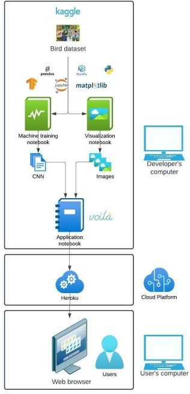

*Figure* *1* *Overview* *of* *application.*

5

Section A  6	

1. ##### Data Description
The dataset we will use for training the model is a public domain dataset taken from Kaggle (Piosenka, 2022). It is a large dataset (2GB) that contains 70,626 training images (between 130 and 248 images per species), 2250 test images (5 images per species), and 2250 validation images (5 images per species).

Since it has at least 100 images per species to train on, we are confident that the model will be able to accurately recognize all bird species.

The images are stored in a directory that contains subdirectories to hold training, testing, and validation images separately. Each subdirectory then contains 450 folders, each named for the species they contain.

The dataset also comes with a csv file containing the following columns:

- class id
- filepaths
- labels
- scientific label
- data set

The label column is the dependent variable, the images are the independent variable.

The dataset was collected by searching the internet for images by species name. Google and Bing tend to skew towards higher ratios of male birds in their search results, and as a result the dataset also tends to be skewed towards male specimens (as high as 80%). This can be significant since many birds have high sexual dimorphism (distinct differences in size, morphology, or coloration between males and females of the same species). An example of this is the Mallard duck, where the males and females have completely different colors. Thus, it is to be expected that the model will do better at classifying males than females, especially in species that have high sexual dimorphism. Because the validation and test images also have the same imbalance, the accuracy of the model might not suffer too much when based on those sets. The real-life accuracy experienced by the users, where this imbalance is of course not present, however, might be lower.

All images have the shape 224 x 224 x 3 (width, height, color channels) and are in jpeg format. The images have been cropped by the author of the dataset to maximize the percentage of the image taken by the actual bird (a minimum of 50% of the pixels in the images are taken by the bird, as opposed to small birds in large backgrounds). This is beneficial for training the model, as it is shown more of the actual bird. However, because the images are of such good quality (close-up birds, cropped to keep only the bird, only one bird per image) users might experience a lower accuracy with their own pictures that might be taken from further away, might be blurrier and are most likely not cropped to keep only the bird.

1. ##### Objective and Hypotheses
Our project hypothesizes that we can train a CNN model so that it will accurately (> 90%) classify bird images into 450 different species.

6

Section A

The objective is to provide an easy-to-use web application that allows a user to upload a picture containing a bird and get a prediction of which species the bird most likely belongs to. This can increase interest and awareness of nature in the user's environment. We also want to present the user with a descriptive analysis of the dataset, in the form of two static visuals and one interactive visual.

1. Methodology

We will use the waterfall methodology for this project. The scope of the project is relatively small and well-defined at the start of the project. Changes in requirements or objectives are unlikely and probably small if they do occur.

The following steps will be taken in this project:

1. **Requirements:** Gather and list all requirements for the entire project.
1. **Design:** Design of the data solution.
1. **Implementation:** Writing the code for the application.
1. **Verification/Testing:** Test the application to assure all requirements are met and to minimize bugs.
1. Deployment: Make the application available to users.
1. Maintenance: Monitor logs and deploy updates to fix bugs or defects.

1. Funding Requirements

|**Cost/ Hour	Total hours	Total cost**|
| :- |
|**Planning** & **Design**|$120	60|$7,200|
|**Development**|$120|200|$24,000|
|**Office space**|$12	260|$3,120|
|**Cloud service (Heroku)\***|$0||$0|
|**Total**|**$34,320**|

*Table 1 Funding requirements.*

1. Stakeholders' Impact

This application will increase awareness about birds and spark the interest of the users in the bird population around them. This will benefit both the user, by bringing them enjoyment and educating them, and by helping it in its efforts to protect and conserve nature in (sub-)urban settings and to raise awareness for fauna around humans.

7

Section A  8	

1. ##### Data Precautions
The dataset that is being used is in the public domain and contains only images of birds. No humans are depicted in any of the images. The dataset does not contain any personal or sensitive information. None of the images contain any inappropriate or cruel behavior towards animals, and they only depict birds in their natural habitat.

1. ##### Developer’s Expertise
I have the required expertise to successfully complete the project. I have two years of experience programming in python and have previously completed web application projects, some of which also used TensorFlow to train machine learning models.

8

Section B  9	

## Section B
1. ##### Problem Statement
People generally feel more involved and connected with things around them that they can recognize or know something about. Creating a web-based application that allows users to quickly and easily classify birds in their immediate environment will bring those users closer to nature and spark a desire to preserve the habitats and species that live around them.

This tool needs to be readily available, easy to use, relatively fast, and accurate for users to use it and to keep using it. We, therefore, propose to make a web-based application that is available through the users’ web browsers without the need to install anything. Identifying a bird should be as easy as uploading a picture from their computer. The machine learning algorithm that powers the application should be at least 90% accurate in predicting the species in the picture.

1. ##### Customer Summary
This application is aimed to be used by the general public, specifically people interested in learning about the diversity of birds in their own neighborhoods. No special skills or knowledge are required to use the application. No installation is necessary, the user can simply use their web browser to access the application. While the application can be used on a mobile environment, it will mostly be optimized for a laptop or desktop computer. By keeping the application simple and easy to access, the threshold for users to educate themselves on the diversity of birds around them will be lowered.

1. ##### Existing System Analysis
Currently,	website features pictures and information about birds commonly found in (sub)urban settings, so that interested users can try to identify the birds they might have spotted in their neighborhood. This approach is not optimal, because subtle differences between two bird species might not be very obvious to the untrained eye, and differentiating between bird species can be hard, especially based on the one or two pictures that are shown on the website. It also requires a lot of searching for the right bird among the many species that are shown on the website. This can cause some users to lose interest.

The machine learning algorithm in the solution we propose will be able to classify a bird in a picture automatically, without the user needing to search for potential matches. Because the algorithm is trained on a very large set of images, featuring over a hundred images per species, it will be able to differentiate between two species of birds that might look very similar to casual viewers. The user can find additional information about the species of bird the application has identified in their picture, without having to search and compare manually, making the experience much more convenient and easier for the user.

1. ##### Data
The dataset that will be used is a publicly available dataset from Kaggle (Piosenka, 2022). It is available at this web address

9

Section B  10	

The dataset contains over 75,000 images of birds. They are already divided into training (70,626), testing (2250), and validation (2250) subsets. The dataset contains 450 species of birds. Both the training and validation subsets contain 5 images per species, the training set contains between 130 and 248 images per species. Because there are so many pictures available in this dataset, we expect the model to have an accuracy of over 90%.

The dataset was collected by searching the internet for images by species name. Google and Bing tend to skew towards higher ratios of male birds in their search results, and as a result the dataset also tends to be skewed towards male specimens (as high as 80%). This can be a significant difference since many birds have high sexual dimorphism (distinct differences in size, morphology, or coloration between males and females of the same species). An example of this is the Mallard duck, where the males and females have completely different colors. Thus, it is to be expected that the model will do better at classifying males than females, especially in species that have high sexual dimorphism. Because the validation and test images also have the same imbalance, the accuracy of the model might not suffer too much when based on those sets. The real-life accuracy, experienced by the users, where this imbalance is of course not present, might therefore be lower.

All images have the shape 224 x 224 x 3 (width, height, color channels) and are in jpeg format. The images have been cropped by the author of the dataset to maximize the percentage of the image taken by the actual bird (a minimum of 50% of the pixels in the images are taken by the bird, as opposed to small birds in large backgrounds). This is beneficial for training the model, as it is shown more of the actual bird. However, because the images are of such good quality (close-up birds, cropped to keep only the bird, only one bird per image) users might experience a lower accuracy with their own pictures that might be taken from further away, might be blurrier and are most likely not cropped to keep only the bird.

The images are stored in a directory that contains subdirectories to hold training, testing, and validation images separately. Each subdirectory then contains 450 folders, each named for the species they contain.

The dataset also comes with a csv file containing the following columns:

- **class** **id:** Unique id per species (0 – 449)
- **filepaths**: Relative path to the image. Example: “train/ABBOTTS BABBLER/001.jpg” where:
  - “train” refers to the training subdirectory,
  - “ABBOTS BABBLER” refers to the species subdirectory and
  - “001” refers to the first image of this species.
- **labels**: Bird species in the image.
- **scientific** **label**: The name of the species in the standard binomial nomenclature, where the first part of the name refers to the genus and the second part refers to the species.

Example: Malacocincla *abbotti*

- **data** **set**: This refers to which subset of the dataset (train/test/validation) the image belongs to.

The label column is the dependent variable, and the images (filepaths) are the independent variable.

From the labels column, we can extract a list of unique labels that our model will be able to recognize, by taking the unique values.

10

Section B  11	

Each label will also be converted to Boolean form, in order to match the output of the model. This converts each label to an array of 450 values, all of them ‘False’ except the value at the place of the label this array represents. For example, the label “ABBOTS BABBLER”, the first label, will look like: [‘True’, ‘False’, ‘False’,…]. The model will output a similar array of 450 values, all between 0 and 1, and all adding up to 1, where each value represents the probability that the bird in the picture belongs to each of the species. If we already have our labels in Boolean form, we can simply check which label has a ‘True’ at the index with the highest probability, to get the predicted label.

The scientific label is generally in the standard binomial nomenclature form or the “Latin name” of the species. This refers to the naming convention where species have a two-part name: the first part refers to their order and the second part to their genus. For example, in Malacocincla *abbotti,* Malacocincla refers to the genus, and *abbotti* to the specific species.

From this column, we will first extract the genus of the bird by splitting the scientific name into the genus and the species. Cross-referencing the genus with a separate list of bird families and the genera and species that belong to those families, found	(Boyd, 2019), will allow me to assign a family to each bird species. The dataset spans 450 species, but those can be reduced to 136 families. Grouping by family rather than by species allows for a more uncluttered view of the data, while still keeping closely related birds together.

Not all the names in the scientific label column follow the two-part naming convention. For example, the antbirds, Thamnophilidae, are only referred to by their family name, and no specific genus or species is given. In those cases, we will refer to both their family, genus, and species with the same name.

In a handful of cases, the genus name given in the bird dataset does not correspond with any genus name in the family list. This can have many reasons, for example, small differences in spelling or conflicting classifications of birds, based on different classification systems used. Biologists continually make changes in classifications, based on new evidence. We can choose to omit these special cases from our data, or we can manually adjust them. Since there are not too many of these mismatches (<20), we will manually check the ‘correct’ family and assign it to the bird. This way there will not be any data missing.

TensorFlow is optimized to work best when the data is provided to it in batches. We will therefore convert the images to tensors and then group them in batches of 32. Any results from the model will also be in batch form and will need to be converted back before they can be read.

1. ##### Project Methodology
The waterfall methodology encompasses the following phases:
1. ####### **Requirements**:

We will meet with	and gather all the requirements for the project. These

requirements should encompass all that the client likes to see in the finished application.

11

Section B  12	

1. ####### **Design**:
Based on the requirements, the overall design of the application will be determined. Decisions such as the layout, programming language, and hosting service will be determined in this phase.
1. ####### **Implementation**:
Writing the application code.

1. The data will be collected.
1. The environment will be set up using miniconda
1. Data analysis
1. Creating visual representations of the data
1. Data preprocessing
1. Creating the model
1. Training the model
1. Evaluating the model
1. Comparing the models and if needed finetuning steps f through h until acceptance goals (>90% accuracy) are met
1. Creating the user interface
1. Testing
1. Deployment to Heroku
1. User guide creation
1. ####### **Verification/Testing:**
   1. Unit and integration testing
   1. Acceptance testing
1. ####### **Deployment**:
The application will be uploaded to Heroku so that it becomes publicly available.
1. ####### **Maintenance**:
Heroku provides logs in the developer’s dashboard that can be used to monitor the activity of the application and identify any possible problems with the application.

1. ##### Project Outcomes
The outcome of the project is the deployment of a fully functional web application, hosted on Heroku, that allows the user to upload their own picture and receive a predicted label in return. The user will also see a bar graph showing the top 3 predicted labels. The web application also allows the user to view two static data analysis visuals: a bar chart showing the number of images in the dataset for each bird species, and a scatter plot showing the number of images in the dataset per bird family. The user will also be able to view an interactive visual, which allows the user to choose a bird family and see the average RGB values for each image in that family.
####### **Project** **Deliverables:**
- Three **jupyter** **notebooks:**
  - One for training the model
  - One for creating the data visualizations

12

Section B  13	

- One for the user interface (included in the application)
- **Three** **trained** **models** from which the most suitable will be chosen.

####### **Product** **Deliverables:**
- A fully trained and optimized **model,** capable of classifying birds with a minimum of 90% accuracy.
- Three **csv** **files**:
  - **Unique\_labels.csv** holds the list of 450 unique bird species that the model will be able to differentiate.
  - **Unique\_families.csv** holds the list of the unique 136 families that our bird species can be grouped in.
  - **Bird\_rgb.csv** holds a column of average RGB values for each image, and a column of which family the image belongs to.
- A jupyter notebook that creates **the** **user** **interface**
- Two **static** **visuals**:
  - Bar chart of the number of images per species
  - Scatter plot of the number of images per family
- ####### **Interactive** **visual**:
  - 3D scatter plot of average RGB values per image for a chosen family
- An easy-to-use user interface hosted on **Heroku**, that incorporates both the classifying functionality as well as two static data analysis visuals and one interactive data analysis visual.
- Files needed for deployment on Heroku:
  - **requirements**: lists the required libraries needed to build the environment on Heroku to run the application, as well as their version numbers (to avoid dependency issues).
  - **runtime**: lists the programming language used (python 3.10.8)
  - **procfile**: tells Heroku what kind of application it is (web) and how it should be launched. We will specify here that we want Heroku to automatically open the notebook with the voila library, so we only see our dashboard.
- A **user** **guide**

1. ##### Implementation Plan
1. Data gathering:
   1. The bird dataset will be downloaded from Kaggle (Piosenka, 2022):
   1. The bird-species-list will be downloaded from the Taxonomy in Flux website (Boyd, 2019):
1. The environment will be set up using miniconda.
1. Data analysis.
1. Creating visual representations of the data:
   1. Bar chart of the number of images per species.
   1. Scatter plot of the number of images per family.
   1. 3D Scatter plot of average RGB values per image for a chosen family.

13

Section B  14	

1. Data preprocessing:
   1. Converting labels to Boolean format.
   1. Making separate lists of training, testing, and validation images (already split in the dataset) and their corresponding labels.
   1. Grouping images in batches.
   1. Converting images to tensors.
1. Creating the model using the URL for the MobileNetV3 pre-trained model (Howard et al., 2019): https://tfhub.dev/google/imagenet/mobilenet v3 large 075 224/classification/5
1. Training the model using the training subset.
1. Evaluating the model.
1. Comparing the models and if needed finetuning steps f through h until acceptance goals (>90% accuracy) are met.
1. Creating the user interface using the voila library and jupyter notebooks.
1. Testing:
   1. Unit testing on individual components.
   1. Integration testing.
   1. Acceptance testing will be done by the team of
1. Deployment to Heroku.
1. Creating the user guide.

1. ##### Evaluation Plan
We will evaluate and compare the different models (MobileNet, ResNet, and EfficientNet) using three metrics:

- **Accuracy** is the ratio of correct predictions over the total number of predictions. An accuracy of 90% means that of the 10 pictures we feed into the model, we expect 9 of them to be labeled correctly. This metric takes an average over all the classes, so smaller classes might be underrepresented in this metric. We want our model to have an accuracy of at least 90%.
- **Precision** is the ratio of true positives over all positives. It measures how accurate the model is in classifying a bird as a certain species. For example: if we let the model predict 10 images, and it correctly identifies 4 of those as swans, but also (falsely) identifies 3 other birds as swans, the precision will only be 57%.
- **Recall** is the ratio of true positives over the total number of positives. Unlike precision, it does not take false positives into account. For example: if our set of 10 images contains 4 swan images, but the model only correctly classifies 3 of those as swans, then we have a recall of 75%, regardless of how many other birds are also classified as swans.

The model should have an **accuracy** **of** **at** **least** **90%,** measured using the testing subset. We will also look at the other metrics and compare the size of the trained models. Heroku has a limited amount of memory that can be used by the application, so we need to make sure the model is lightweight.

We will perform unit testing and integration testing to assure all individual components work as intended and work together as intended. The customer (	will do acceptance testing to assure the product meets their needs.

14

Section B  15	

1. ##### Resources and Costs
####### **Programming** **Environment:**
- Development of the application will be done on the developer’s computer, which runs on Windows
1. It has an NVIDIA Geforce GTX 1080 GPU. It has an Intel i7 4 Core CPU with 32.0 GB RAM.
- The coding will be done in Jupyter notebooks, using python 3.10.
- Miniconda will be used to create two separate environments:
  - The notebook that does the model training will run in an environment that includes the GPU- enabled version of TensorFlow. This allows us to utilize the GPU to train the model. Because the dataset contains so many training images (> 75k), a GPU is needed to train the model in a reasonable time. Because of dependency conflicts, this environment cannot also contain matplotlib, the library we will need to create the visualizations. We will use a separate environment and notebook for this.

This environment will include the following major libraries:

- Tensorflow (full GPU version)
- Tensorflow Hub
- NumPy
- Pandas
- IPython
- The notebooks for the visualizations and the user interface will run in a separate environment that has the CPU-only version of TensorFlow installed. This version does not allow the use of the GPU, but it can be combined with matplotlib, and it requires a lot less memory. This is important especially for the user interface because Heroku has a limited available memory quota, and the environment takes up the majority of the memory needed by the application.

This environment will include the following major libraries:

- Tensorflow-CPU
- Tensorflow hub
- NumPy
- Pandas
- Matplotlib
- Ipywidgets
- PIL
- IPython
- Voila
- The finished application will be hosted online on Heroku.com. The user interface notebook will contain the GUI that is visualized using the voila library to provide the user with a dashboard. The requirements document will contain all the required libraries needed for the Heroku platform to build the correct environment.

####### **Environment** **costs:**
The environment will not require the purchase of any new materials or tools. The libraries and tools we will use are free and open-source. The rent for the office space where the application will be developed is $12 per hour. For a total expected development time of 260 hours, this comes to $3,120.

15

Section B

Hosting on Heroku is currently free, but this cost might increase if more bandwidth or memory is needed in the future, or if the terms of service change.

|Human resources costs:||
| :- | :- |
||**Cost/ Hour**|**Total hours**|**Total cost**|
|**Planning** & **Design**|S 120|60|S 7,200|
|

**Development**
|I s120|! 200|I s 24,000|

*Table* 2 *Human resources costs.*

**Total overview:**

|**Cost**|*I*|**Hour**|**Total hours**|**Total cost**|
| -: | :- | :- | :- | :- |
|**Planning** & **Design**|S 120||60|S 7,200|
|**Development**|S 120|200|S 24,000|
|**Office space**|S 12||260|S 3,120|
|**Cloud service (Heroku)**|so||so|
|**Total**||1 $34,320|

*Table 3 Total costs overview.*

10\. Timeline and Milestones

Since all the resources (developer's salary and office rental) depend on the number of hours spend on each task, we will list them as the time (in hours) needed to complete the task.

|
**Data gathering**

Environment setup
|

10/20/22
||
1

1
||
4

4
|
| :- | :- | :- | :-: | :- | :-: |
|**Data analysis**|10/20/22 -10/21/22|2|Data gathering, environment setup|16|
|Visuals Creation|10/24/22 -10/28/22|5|Data analysis|40|
|
**Data**

preprocessing
|10/31/22 - 11/1/22|2|Data gathering, environment setup|8|
|Model creation|11/2/22|1|Data preprocessing|4|
|Model training|11/2/22|1|Model creation|4|

17

|Model evaluation and comparison|11/3/22 -11/4/22|2|Model training|8|
| :- | :- | :-: | :- | :-: |
|**User interface creation**|11/7/22 - 11/11/22|5|Environment setup|40|
|Testing|11/14/22 -11/18/22|5|
Model evaluation, visuals creation,

user interface creation
|40|
|**Deployment to Heroku**|11/21/22 -11/21/22|1|Model evaluation, visuals creation, user interface creation, testing|8|
|
User **guide**

creation
|11/22/22 -11/24/22|3|Deployment|24|

*Table 4 Project milestones.*

Bird classification application

1

4\.1

Cl

•-

NatureAroundU

<table><tr><th colspan="1" valign="top">o t d--le-,n9</th><th colspan="1" valign="top">1\.1</th><th colspan="1" valign="top">10120122</th><th colspan="1" valign="top">10120122</th><th colspan="1" rowspan="2" valign="top"></th></tr>
<tr><td colspan="1" valign="top">Envitol'lrnet"il"'-'_.P</td><td colspan="1" valign="top">1\.2</td><td colspan="1" valign="top">10120122</td><td colspan="1" valign="top">10120'22</td></tr>
<tr><td colspan="1" valign="top">Octa cnal sli</td><td colspan="1" valign="top">1\.3</td><td colspan="1" valign="top">10120122</td><td colspan="1" valign="top">10121122</td><td colspan="1" valign="top">1\.1,1.2</td></tr>
<tr><td colspan="1" valign="top">VISU:IISc1ea:1on</td><td colspan="1" valign="top">1\.4</td><td colspan="1" valign="top">1012 122</td><td colspan="1" valign="top">10126'22</td><td colspan="1" valign="top">1\.3</td></tr>
<tr><td colspan="1" valign="top">Dato i:,ep1ocessing</td><td colspan="1" valign="top">1\.5</td><td colspan="1" valign="top">1)/3122</td><td colspan="1" valign="top">TlnlZZ</td><td colspan="1" valign="top">ll, 1.2</td></tr>
<tr><td colspan="1" valign="top"><b>Model creation and training</b></td><td colspan="1" valign="top"></td><td colspan="1" valign="top"></td><td colspan="1" valign="top"></td><td colspan="1" valign="top"></td></tr>
<tr><td colspan="1" valign="top">Mo ICieafon</td><td colspan="1" valign="top">21</td><td colspan="1" valign="top">1112122</td><td colspan="1" valign="top">TI/2122</td><td colspan="1" valign="top">1\.5</td></tr>
<tr><td colspan="1" valign="top">lllocblTr.:rii-lil'lg</td><td colspan="1" valign="top">22</td><td colspan="1" valign="top">1112122</td><td colspan="1" valign="top">1112122</td><td colspan="1" valign="top">2\.1</td></tr>
<tr><td colspan="1" valign="top">Mod=levdu,tion,oom ri::on dnett.1r,irg</td><td colspan="1" valign="top">2\.3</td><td colspan="1" valign="top">1113122</td><td colspan="1" valign="top">1114122</td><td colspan="1" valign="top">2\.2</td></tr>
<tr><td colspan="1" valign="top"><b>Use-, inte-.-fe  de-•elopmelll</b></td><td colspan="1" valign="top"></td><td colspan="1" valign="top"></td><td colspan="1" valign="top"></td><td colspan="1" valign="top"></td></tr>
<tr><td colspan="1" valign="top">Use,1me1facec1eatbn</td><td colspan="1" valign="top">3\.1</td><td colspan="1" valign="top">11(7122</td><td colspan="1" valign="top">11111122</td><td colspan="1" valign="top">1\.2</td></tr>
<tr><td colspan="1" valign="top"><b>Tenllg and deplo,ment</b></td><td colspan="1" valign="top"></td><td colspan="1" valign="top"></td><td colspan="1" valign="top"></td><td colspan="1" valign="top"></td></tr>
<tr><td colspan="1" valign="top">Tesbn9</td><td colspan="1" valign="top">4\.1</td><td colspan="1" valign="top">Tlll4fZZ</td><td colspan="1" valign="top">111'5122</td><td colspan="1" valign="top">1\.3,2.3,3.</td></tr>
<tr><td colspan="1" valign="top">Oepb11rnenuo l-.e1oku</td><td colspan="1" valign="top">4\.2</td><td colspan="1" valign="top">1112122</td><td colspan="1" valign="top">11121122 1.</td><td colspan="1" valign="top">3, 2.3,3.1,</td></tr>
<tr><td colspan="1" valign="top">Use,!J.,ide</td><td colspan="1" valign="top">43</td><td colspan="1" valign="top">11122122</td><td colspan="1" valign="top">1124122</td><td colspan="1" valign="top">4\.2</td></tr>
</table>

*Figure 2 Project Gantt chart.*

Section D  18	

## Section D
1. ##### Project Purpose
is a non-profit organization that aims to increase awareness and involvement of the general public in the preservation of nature found in the public’s neighborhoods. To bring people closer to the bird population living among them, a web application was developed that allows the user to upload a picture they took of a bird. The application is capable of recognizing which bird is depicted in the image and displays the species name to the user, as well as the top 3 predicted species and the probabilities that the bird in the image belongs to each of those species. The underlying machine learning model has an accuracy of 95% and the application itself is intuitive and easy to use.

The users can also explore some of the dataset characteristics through the visuals integrated into the application, such as the bar chart showing the number of images of each bird species in the dataset, the scatter plot showing the number of images of each bird family in the dataset and the 3D interactive scatter plot that shows the average RGB values for each image in a chosen bird family.

Having an easy way to learn more about these animals increases awareness, interest, and goodwill in the public which can lead to a better coexistence between humans and animals.

1. ##### Datasets
The main dataset is a publicly available bird dataset found on Kaggle (Piosenka, 2022) at this URL:

The dataset was already very organized and clean, so very little processing was needed to make it useful for our application. The set contains a total of 75,126 images, divided into 70,626 training images, 2250 testing images, and 2250 validation images, already separated into three subdirectories. The dataset contains 450 species of birds. Both the training and validation subsets contain 5 images per species, the training set contains between 130 and 248 images per species.

*Figure* *3* *Number* *of* *images* *per* *species.*

18

Section D  19	

All images had already been cropped to maximize the bird in the picture and they had all been resized to the shape 224 x 224 x 3 (width, height, color channels) and stored in jpeg format. Since birds don’t change their appearances, the time or year in which the images were taken/collected is largely irrelevant. The dataset contains images of birds occurring all over the world, so the place the picture was taken is also irrelevant.

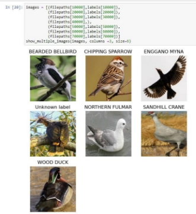

*Figure* *4* *Visualization* *of* *a* *handful* *of* *randomly* *selected* *images.*

The accompanying csv file lists the following features for each image:

- **class** **id:** Unique id per species (0 – 449)
- **filepaths**: Relative path to the image.
- **labels**: Bird species in the image.
- **scientific** **label**: The name of the species in the standard binomial nomenclature.
- **data** **set**: train/test/validation

*Figure* *5* *Example* *of* *the* *raw* *dataset* *csv* *file.*

19

Section D  20	

From this dataset, we extracted and saved a list of unique bird labels, which is the 450 bird species that our model can recognize. Each label is then converted to Boolean form.

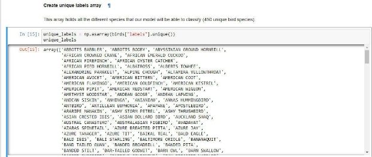

*Figure* *6* *Unique* *labels* *array.*

To add the family name to each bird species, we retrieve a list of all bird families and the genera that they contain from the Taxonomy in Flux website (Boyd, 2019):

*Figure* *7* *Raw* *birds* *family* *list.*

After reading this csv file into the notebook, we can clean it up a little by removing unnecessary columns and dropping duplicate rows.

20

Section D  21	

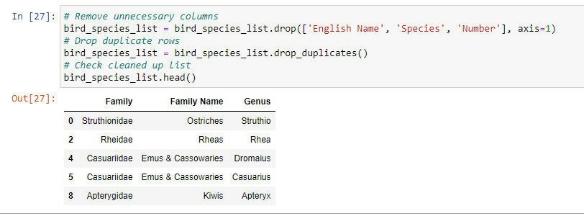

*Figure* *8* *Cleaned-up* *birds'* *family* *list.*

Before we can add the family name to the birds dataframe, we need to split the scientific name into genera and species. We only keep the genus.

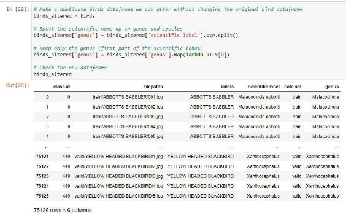

*Figure* *9* *Creation* *of* *genus* *column.*

Then we can join the bird family list with the birds dataframe so that the birds dataframe gains two extra columns: one with the scientific family name and one with the common family name.

21

**Section D**

ln [29): # *Joto the* t1t0 *datafro.mes to odd the fo.frl.ly oa,r,e based on the ge,ws*

joined\_birds - birds\_altered.set\_index( 'genus·) .join(bird\_species\_list. set\_i-ndex( 'Ge(lUS' ))

*11 sort*

file11aths	..,

joined\_birds.sort\_values(by=[ 'class id'))

Oot[29]:	ciass	labels	scientific lclbel	<lata

**Id**



Family	F mily Name

|train|Pel!orneictae|G!O\!OCI Sabl)tefS|
| :-: | :-: | :-: |
|train|Pe-llorneioae|

Groone!Babb rs
|
|train|

Pel!orneictae
|

G!O\!OCI Sabl)tefS
|
|train|Pe-llorneioae|

Groone!Babb rs
|
|train|Pel!orneictae|

G!O\!OCI Sabl)tefS
|
|train train train train train|

lctenoae	NewWorld

Bl•ckbirds

lcter1oae	NewWorld

Blackbirds

lctenoae	NewWorld

Bl•ckbirds

lcter1oae	NewWorld

Blackbirds

lctenoae	NewWorld

Bl•ckbirds
|

|
Mataoocinc1a

Ma1aoocinc1a
||
trah/ABBOTTS BAB8LER/031Jpg

llain/ABBOTTS B .88LERf114.jpg
|
ABBOTTS BASSLER

ABBOTTS 8A88LER
|
| :- | :- | :- | :- |
|
Mataoocinc1a

Ma1aoocinc1a

Mataoocinc1a
||

l1aln/ABBOTTS BABSLERfl15.jpg

llain/ABBOTTS B .88LERf116.jpg

l1aln/ABBOTTS BABSLERfl17Jpg
|

ABBOTTS BABBLER

ABBOTTS 8A88LER

ABBOTTS BASSLER
|

Ma!acocincta

ab:Oo:ti

M acocinc:le

abbo1l

Ma!acocincta

ab:Oo:ti

M acocinc:le

abbo1l

Ma!acocincta

ab:Oo:ti

BLACKBIR0/100iPO	BLACKBIRD

BLACKBIR0/105 /PO	BLACKBIRD

BLACKBIR0/104iPO	BLACKBIRD

BlACKBIR01102jPQ	BLACKBIRD

BLACKBIR0/126iPO	BLACKBIRD
xanttiocoPhalus **449**	train/YELLOW HEADED	YELLOW HEADED xalllhocepllatJ& xanttiocephalus **•49**	trainlYELLOW HEADED	YELLOW HEADED	xa1ut1ocepnat.1s xanttiocoPhalus **449**	train/YELLOW HEADED	YELLOW HEADED xalllhocepllatJ& xanttiocephalus **•49**	trainlYELLOW HEADED	YELLOW HEADED	xa1ut1ocepnat.1s xanttiocoPhalus  **449**	train/YELLOW HEADED	YELLOW HEADED  xalllhocepllatJ&

75126 rows, 7columns

*Figure 10 Adding scientific family name and common family name.*

**At this point, we checked to make sure each species had been assigned its family, but we noticed there were 3274 images for which no family was added. This corresponds to around 20 species.**

In  [30]:  # *Check if	there are any rm·Js that did not get a family name*

joined\_birds,.here(joined\_birds["Family Name").isna()). count(}

Out[30]:  class  *id*	3274

filepaths	3274

labels	3274

scientific  label	3274

data  set	3274

Family	0

Family  Name	0

dtype: int64

There are 3274 images where no family name has been added.

*Figure 11 Images without a family name.*

This **might have happened because of alternative spellings, changes** in **the classification of the birds, or different classification systems used. We can opt to either remove these birds from the statistics or we can alter the family name to make them match. Since there are not too many instances of this, we chose here to manually adjust the family names where needed, so we do not lose any information.**

22

Section D  23	

…

*Figure* *12* *Manual* *adjustment* *of* *missing* *family* *names.*

*Figure* *13* *Function* *replace\_family\_name().*

The resulting dataframe has the scientific family name and common family name added for each image.

*Figure* *14* *Dataframe* *with* *the* *family* *names.*

23

Section D  24	

1. ##### Data Product Code
The product code was split over three separate notebooks, one for training the model, one for creating the visualizations, and one for creating the user interface.

1. *Model* *training* *notebook*

In this notebook, we processed the data so that it was ready to be used to train the model. We also compared three convolutional neural networks (CNNs) and picked the one that gave the best results.

This notebook runs in a separate environment that has the GPU-enabled version of TensorFlow installed. This gives a significant speed boost when training the model. Because of compatibility issues, this unfortunately also means that matplotlib could not be installed in this environment.

Setting up the environment and reading the data

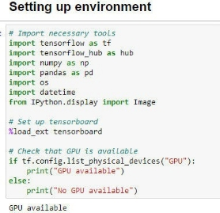

*Figure* *15* *Importing* *the* *libraries.*

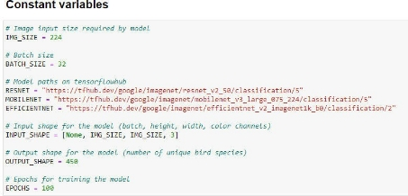

*Figure* *16* *Constants.*

24

Section D  25	

First, we read the dataset from the csv file.

*Figure* *17* *Reading* *in* *the* *bird* *csv* *file.*

We make a list of unique labels (unique bird species).

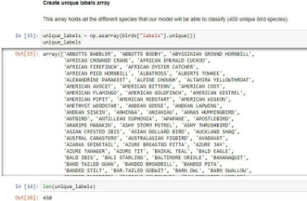

*Figure* *18* *Create* *unique* *labels* *list.*

From the birds dataframe, we can extract the filepaths to the images and the corresponding labels. We convert the labels to Boolean form.

25

Section D  26	

*Figure* *19* *Creation* *of* *filepaths,* *labels,* *and* *boolean* *labels.*

We split the dataset into a training set, a test set, and a validation set. For development purposes, we also create a smaller subset of the training set (1000 images) which we used to try out training the model, without having to wait too long for the results.

26

Section D  27	

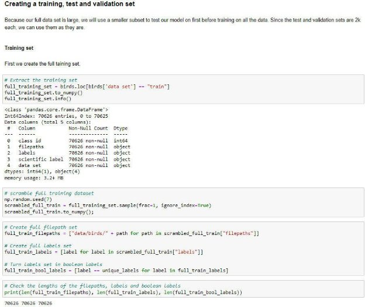

*Figure* *20* *Creation* *of* *full* *training* *subset* *and* *smaller* *training* *subset.*

We do the same for the test set and the validation set.

27

Section D  28	

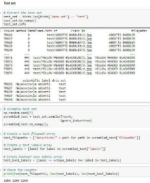	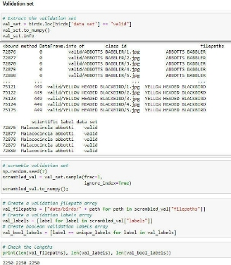

*Figure* *21* *Creation* *of* *test* *set.*	*Figure* *22* *Creation* *of* *validation* *set.*

Preprocessing the data

TensorFlow is optimized to work best when the data is provided to it in batches. We will use the function batchify() to convert the images to tensors and then group them in batches of 32. The batchify function in turn uses the function image\_to\_tensor(), which reads the image, decodes it, converts it to numeric form, and resizes it to the correct size (224px by 224 px).

*Figure* *23* *Preprocessing* *the* *images.*

28

Section D  29	

*Figure* *24* *Functions* *image\_to\_tensor()* *and* *batchify().*

Training the models

Now we are ready to train the model. We will train and compare three pre-trained models. All three of these models have been pre-trained on the ImageNet (ILSVRC-2012-CLS) dataset (Russakovsky et al., 2015) to classify general images.

- ResNet50: a 50-layer convolutional neural network. (He et al., 2015) https://tfhub.dev/google/imagenet/resnet v2 50/classification/5
- MobileNetV3: a lightweight CNN. (Howard et al., 2019) https://tfhub.dev/google/imagenet/mobilenet v3 large 075 224/classification/5
- EfficientNet: a CNN optimized for faster training. (Tan & Le, 2021) https://tfhub.dev/google/imagenet/efficientnet v2 imagenet1k b0/classification/2

The create\_and\_train\_model() function calls the create\_model() function to create the model. Then it creates the callbacks by calling the create\_tensorboard\_callback() and the create\_early\_stopping\_callback() functions. Lastly, it fits the model on the training data and uses the validation data to evaluate the model. Then it returns the whole model.

29

Section D  30	

*Figure* *25* *The* *create\_and\_train\_model()* *function.*

The create\_model() function creates the model. It defines the input and output layers. It also compiles the model. For the loss function, we use CategoricalCrossentropy. We use the Adam optimizer. For metrics, we track the accuracy, the precision, and the recall. Then we build the model and define the input shape.

*Figure* *26* *The* *create\_model()* *function.*

The create\_tensorboard\_callback() function creates the callback so that we can view the metrics of the training process on the tensorboard afterward.

The create\_early\_stopping\_callback() function creates the callback that stops the training process when the validation accuracy no longer improves. This can help prevent overfitting the model. It has a standard patience of 3, meaning that 3 consecutive val\_accuracies need to be lower than the one before for the callback to activate.

30

Section D  31	

*Figure* *27* *The* *create\_tensorboard\_callback()* *and* *create\_early\_stopping\_callback()* *functions.*

The fit\_model() function takes the model, the training data (x), the validation data, the callbacks, and the number of epochs and fits the model. Then it returns the fitted model.

*Figure* *28* *The* *fit\_model()* *function.*

The save\_model() and load\_model() functions save and load the trained model so we can reuse them later or in other notebooks.

*Figure* *29* *The* *save\_model()* *and* *load\_model()* *functions.*

31

Section D  32	

First, we train a ResNet model. We can see here that we get a final validation accuracy of 89%, just below our target of a minimum of 90% accuracy. The training lasted for 17 epochs before the early\_stopping\_callback decided the accuracy was no longer improving. Each epoch took around 131s, for a total training time of 37 minutes. The trained ResNet model is 103MB. We will evaluate and compare the models in more detail later.

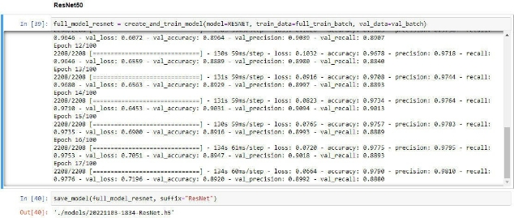

*Figure* *30* *Training* *the* *ResNet* *model.*

The next model is the MobileNet model. We get a final val\_accuracy of 93%, which is above our goal of 90%. The training lasted for only 9 epochs, and each epoch took roughly 75s, for a total of 11 minutes. The trained model is 20MB.

*Figure* *31* *Training* *the* *MobileNet* *model.*

32

Section D  33	

The last model is EfficientNet. We get a final val\_accuracy of 91%, which is above our goal of 90%. The training lasted for 21 epochs, and each epoch took roughly 98s, for a total of 34 minutes (even though this model is supposed to be optimized for faster training). The trained model is 33MB.

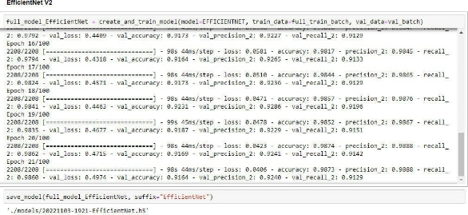

*Figure* *32* *Training* *the* *EfficientNet* *model.*

Comparing the models

After training is complete, we can check the Tensorboard to see the metrics of the three models. We are only interested in the metrics of the validation data, not the training data.
####### **Accuracy:**
MobileNet achieves the highest final accuracy with 93%. Next is EfficientNet with 91% and lastly ResNet with an accuracy of 89%.

33

Section D

r.' 9,QwdatacbwnlOOdlmk

!, lgno,eoutl1cnInchart,ca!ln,

FihE'f taQt (r'egul&r tXJ'lr'M iOM $UDP(>fled)

cpoct1\_acru1dc.:y

T $ortt1g

melhoct-

\-

default  ...

C :)OC:Uf;)Cy

tll(J• lfMV

Smo<Xhing

0\.6

m

Ho,izontal hi9

AA.UJVf

Ru,,• volidetion

" Q R,>osNl'I\Vllidotton

II O Moblle.Net\valkbtion

*&,a* O E:f&:.ont""°'1\v ld t00tt

lOGGlt ALLRlNS (JK8T'llfffl/CeostMe/l09s/



Ill! Harne



.,

Stnoothed Valoo Step nme	Reial.Ive

•	Cfl\e! t\voM•tlor  0◊17.4	OQ 6-4 2:>  Ne-,,'.) 1"=21 1S )lm2?•

0  4nl•li t\v ••1hnn  n'l:t"i'l	OIJ1'7 II	n., Nr:v U 4.'i47 Hln Or.

Q KftN-et\vlitdatJ:K'l	089".M	0892 1!)  huNot:i 1b'.::t41!i ::i:.m12&

*Figure 33 Accuracy for the three models.*

Loss:

MobileNet does best for loss as well, with a loss of 0.27. Next comes EfficientNet with a loss of 0.47 and lastly ResNet with a loss of 0.69.

epoch\_loss

tag·epoch.Joss

0	0	10	12	14	1b	1d	,o

**Relatl•e**

Ill!

**Name	Smoottled** Value Step llme

33m27s

**V**

, Q [ffic1cntNe1\vahdat1on 04755	04974  20	ThuNov 3, 192115

- MobI1eNe1\vallda1Ion  0211a	02817 8	IhuNov3.184 41 10mos

,	RoGNot\vahdoton	06953	07196 16	ThuNov3,183415 35m12s	**V**

*Figure 34 Loss for the three models.*

**34**

Section D  35	

####### **Precision:**
MobileNet has a final precision of 94%, ResNet reaches 90%, and EfficientNet reaches 92%.

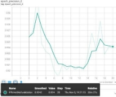

35

*Figure* *35* *Precision* *of* *ResNet.*

####### **Recall:**
*Figure* *36* *Precision* *of* *MobileNet*	*Figure* *37* *Precision* *of* *EfficientNet*

MobileNet has a final recall of 93%, ResNet reaches 88%, and EfficientNet has 91%.

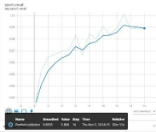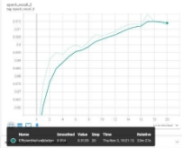

*Figure* *35* *Recall* *of* *ResNet.*	*Figure* *36* *Recall* *of* *MobileNet.*	*Figure* *37* *Recall* *of* *EfficientNet.*

The above graphs compare the three models based on the validation dataset. We can also compare them using the testing dataset.

Section D  36	

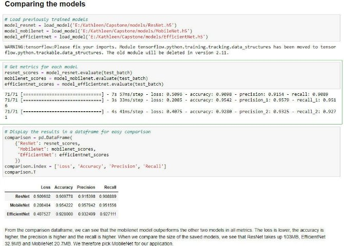

*Figure* *38* *Comparison* *of* *the* *three* *models.*

We see that the MobileNet does best in all metrics, and takes up the least amount of memory, so the decision of which model to use for our application is easy.

1. *Visualization* *notebook*

This notebook is used to visualize the dataset and the predictions made by the model.

Setting up the environment and loading up the data.

First, we set up our imports and constants.

36

Section D  37	

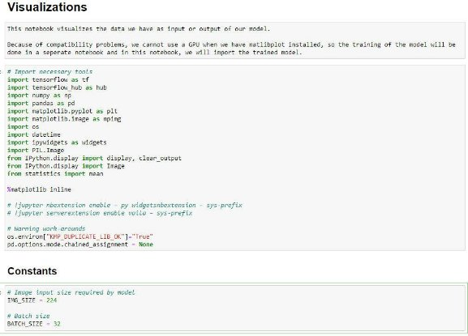

*Figure* *39* *Imports* *and* *constants.*

We read the data into the notebook and convert it to filepaths and labels in the same way as we did in the model training notebook. We can visually explore some of the images of the dataset to get an idea of what we are working with.

For this, we can use three functions. Show\_image() reads a filepath and displays the image and the label (if given). Show\_num\_image() takes an image that is in numeric format and displays it with the label (if given). Show\_multiple\_images() takes a list, the number of columns you want to show them in, and the size the images should be and displays a grid of images with the labels above them. If the label is missing, it shows “Unknown label” above the image.

37

Section D  38	

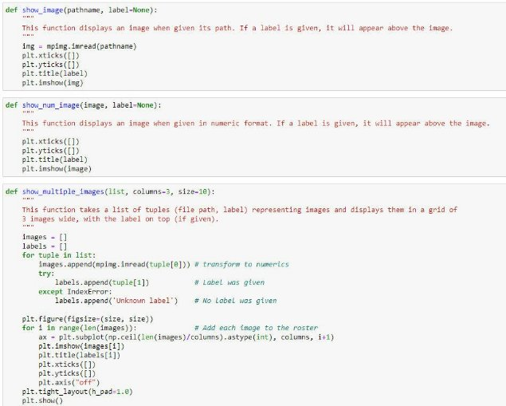

*Figure* *40* *Functions* *show\_image(),* *show\_num\_image()* *and* *show\_multiple\_images().*

*Figure* *41* *Visualization* *of* *a* *single* *image.*	*Figure* *42* *Visualization* *of* *multiple* *images.*

38

Section D  39	

Next, we check the number of images in the different subsets (training, testing, and validation). We see that the validation and test sets both have exactly 5 images per species. The training set has between 248 and 130 images per species, so the total set has between 258 and 140 images per species. Each species has at least 100 images, so we should get a decent accuracy in our model.

*Figure* *43* *Number* *of* *images* *per* *species* *in* *the* *training* *set.*	*Figure* *44* *Number* *of* *images* *per* *species* *in* *the* *test* *set.*

*Figure* *45* *Number* *of* *images* *in* *the* *validation* *set.*	*Figure* *46* *Number* *of* *images* *in* *the* *whole* *dataset.*

39

Section D  40	

Visualization 1: Bar plot of images per species.

Our first visual is a bar plot that shows the number of images per species.

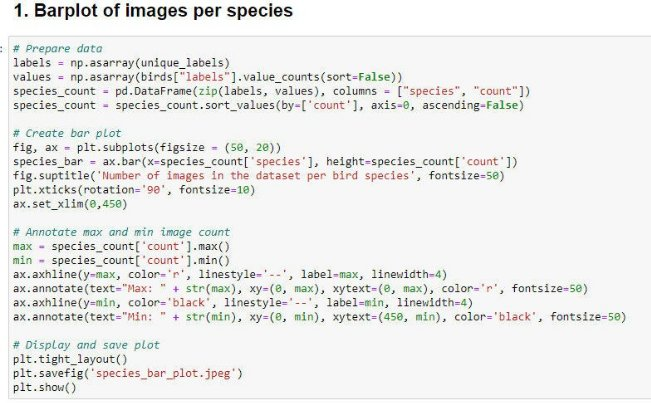

*Figure* *47* *Code* *to* *create* *a* *barplot* *of* *images* *per* *species.*

*Figure* *48* *Bar* *plot* *of* *images* *per* *species.*

40

Section D  41	

Visualization 2: Scatter plot of images per family.

The second visual is a scatter plot representing the number of images per family. We have discussed how we added the family column to the birds dataframe in section D.2. Now we will use this dataframe to create a scatterplot that displays the number of images per family of birds.

First, we count the number of images per family.

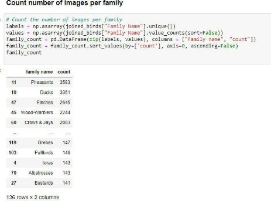

*Figure* *49* *Count* *the* *number* *of* *images* *per* *family.*

We can manually verify (some) of these numbers.

*Figure* *50* *Verification* *of* *family* *counts.*

41

Section D  42	

Then we create a scatter plot that displays the number of images per bird family.

*Figure* *51* *Code* *to* *create* *a* *scatter* *plot* *displaying* *the* *number* *of* *images* *per* *bird* *family.*

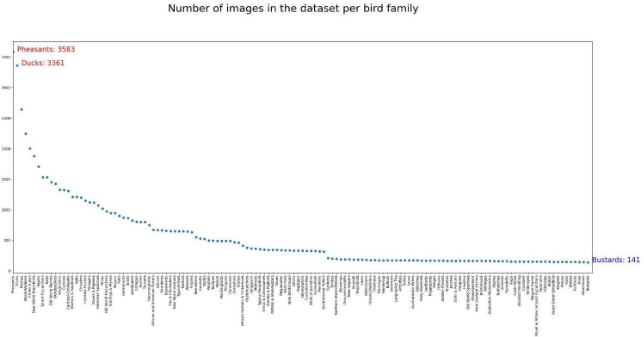

*Figure* *52* *Scatter* *plot* *displaying* *the* *number* *of* *images* *per* *bird* *family.*

42

Section D  43	

Visualization 3: 3D Scatter plot of average RGB values

The third visual will be rendered interactively in the user\_interface notebook, but because the preparation is done in the visualization notebook, we will discuss it here.

For each image, we calculate the average value of the **R**ed, **G**reen, and **B**lue color channels. We add this to our joined\_birds dataframe because this has the families as well, then we remove any unnecessary columns, keeping only the family name and the RGB values. Unfortunately, because we have so many images, the process of getting the average RGB values takes a long time (> 1 hour), so we save the dataframe as a csv file and read it again for further use.

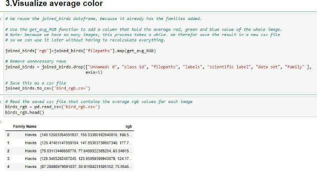

*Figure* *53* *Preparation* *of* *average* *RGB* *colors*

*Figure* *54* *The* *function* *get\_avg\_RGB().*

43

Section D  44	

We also need a list of unique family names.

*Figure* *55* *Unique* *family* *names.*

The function colored\_scatter takes a family name and displays a 3D scatter plot representing all images belonging to that family. Each dot on the plot has the average color of that image. The x-axis represents green, the y-axis represents red and the z-axis represents blue.

Because the csv file saves the average RGB values as a string and not a list, we use the function string\_rgb\_to\_float() to convert it back to a list of three floats.

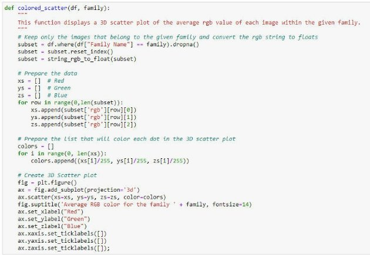

*Figure* *56* *The* *function* *colored\_scatter().*

44

Section D

def  string\_rgb\_to\_float(df):

This function converts RGB values that are in string format to float format in a given dataframe. for ro , in range(0, len(df)):

df[0rgb'][row] = df['rgb'][row].split()	# *Splits the string into 3 parts*

df['rgb'][row][0]  =  float(df['rgb'][row][0][1:-l])  # *Red*

df[ ·rgb· ][row][l]  = float( df[·rgb· ][ row][l][:-1])	# *Green*

df['rgb'][row][2]  =  float(df['rgb'][row][2][:-1])	# *BLue*

return df

*Figure 57 The function string\_rgb\_toJloat().*

The result is a 3D scatter plot representing all the images belonging to a given family of birds.

*fl rhe colored\_scattef' function creat:es and displays a 3D scarcer plot where each dot represents an tn,cge tn thot far,Hy.*

colored\_scaner(df=birds\_rgb, faoily="Leaf birds")

t
Average RGB color for the family Leafbirds

# 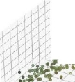tt,
=i.t.t J	-{

Average RGB color for the family Flamingos

. );f•

Blue

Blue

- .	'--
•.	•  ':-f,

\-

•

/	*--/*	.........

---

*-.,I  7*

- ...... .....

--	,. , "-

..,

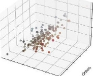Red

*Figure 58 Plot of average RGB values of /ea/birds.*

Re<l

*Figure 59 Plot of average RGB values of flamingos.*

Making predictions

The last thing we do in this notebook is to make and visualize predictions made by our model. We create our test batches the same way as we did in the model training notebook previously. We do not need the training or validation datasets here.

Because we want to display the image we predicted the labelfor, we use the function unbatchify() to take the images out of the batches again. The function get\_predicted\_label() turns the array of probabilities that is returned by the model into the most likely label for the image.

We see that our model predicted that the image was 99% certainly a crested kingfisher, which turns out to be correct when we check the actual label.

45

Section D  46	

*Figure* *60* *The* *function* *unbatchify()*

*Figure* *61* *The* *function* *get\_predicted\_label().*

46

Section D  47	

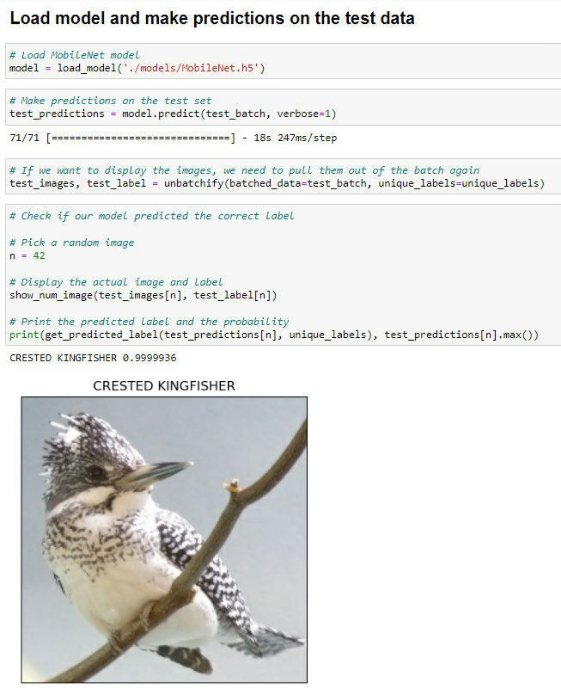

*Figure* *62* *Predicting* *the* *label* *of* *a* *random* *image* *from* *the* *test* *batch.*

We can also predict the labels of images that do not come from the dataset. We downloaded a picture of a goldfinch from the internet and let the model predict the label.

47

Section D  48	

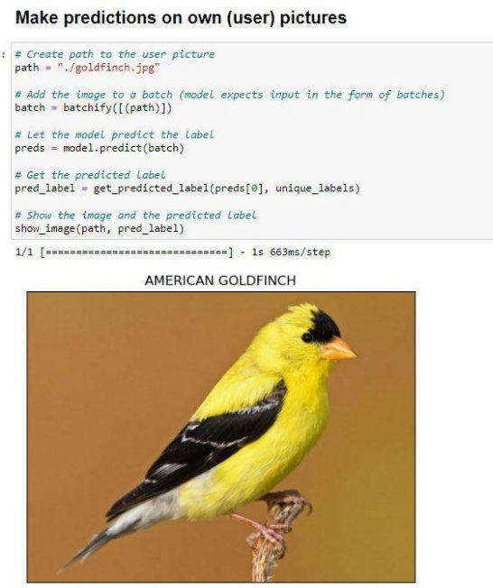

*Figure* *63* *Make* *predictions* *on* *user* *images.*

48

Section D  49	

1. *User* *Interface* *notebook*

The last notebook is primarily used to create the user interface. This is the only notebook that is included in the actual application that is uploaded to Heroku. It relies heavily on the use of widgets and the voila library that can display the notebook as a dashboard.

Because we don’t want to display anything other than our dashboard, we do not use markup in this notebook. We also added some code to suppress some warnings.

Setting up the application

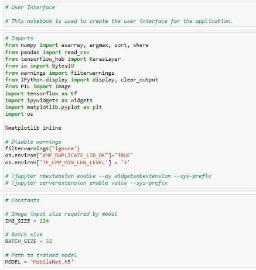

*Figure* *64* *Imports* *and* *constants.*

We start by defining the layouts for the VBoxes and HBoxes we will use in our application, so they all look uniformly. Then we create the title of the application, as well as the banner that will be displayed at the top, and some instructions for the users.

49

Section D  50	

*Figure* *65* *Setup* *of* *the* *layout,* *title,* *instructions,* *and* *banner.*

Next, we set up the output box, which is the lower half of the application, where the requested information will be displayed, depending on which buttons the user clicks. We initialize it but leave it empty for now. Likewise, we initialize the box that will hold the result of the interactive third visual, but leave it empty for now.

The uploader is a button that will allow the user to upload their photo to the application. It only accepts the formats ‘jpeg’ and ‘jpg’ to make sure no incompatible files are uploaded to the model.

We read the csv file that holds the unique labels (all 450 bird species) into a list. We also read all the unique families into a list and sort them alphabetically.

Then we load our trained MobileNet model.

50

Section D  51	

*Figure* *66* *Setting* *up* *the* *application* *and* *loading* *the* *data.*

The next step is creating buttons that allow the user to choose what he wants to do or display in our application. Each button is linked to a large function that executes when the user clicks the button. We will discuss these later.

*Figure* *67* *Setting* *up* *the* *user* *interface* *buttons.*

51

Section D  52	

Next, we group all these parts together in the overall application box, and we create the output widget that will hold and display the output box.

When we execute the “out” widget, our application gets loaded and displayed.

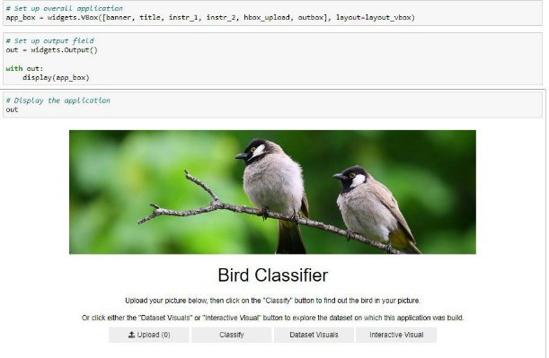

*Figure* *68* *The* *full* *application.*

Classify Button

The first pair of buttons will allow the user to classify a picture of a bird they upload to the application. When they click the uploader button, they can select a picture they want to upload. Nothing else happens at this time, except that the picture is uploaded to the application.

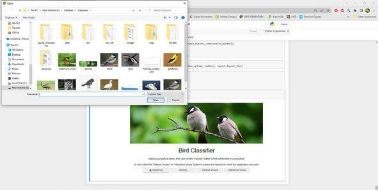

*Figure* *69* *Uploader* *window.*

52

Section D  53	

Next, the user clicks on Classify, which calls the on\_classify\_button\_clicked() function. This is a very large function that calls several other functions.

First, it clears any previous results from the outbox and sets a placeholder where the uploaded image of the bird will later be displayed. It resets the img and img\_resized variables.

Then it reads the image from the uploader. At this point, the function checks whether an image was uploaded by checking that img has a value. If the user clicked the “Classify” button before uploading an image, the else clause gets activated, and the user sees the placeholder image with some text that no valid image was uploaded (see figure 74).

If there is an image loaded, the function then resizes it to fit the format that the model is trained on, and saves it so that a path to the image can be fed into the classify() function later. The image is then first converted to a bytes array and then to an Image widget for display later.

As mentioned, the classify() function will then take the image path and run it through the model to get an array of probabilities for each bird species. The get\_predicted\_label() function we saw in the visualization notebook then retrieves the most likely label for the image.

From these predictions, we also take the top 3 predictions, and their corresponding labels, and turn them into a bar graph.

All these outputs (the user image, the predicted label, and the bar chart with the top 3 predictions) are then combined into a Vbox and loaded into the output window to be displayed (see figure 75).

Lastly, the uploader is reset.

53

Section D  54	

*Figure* *70* *The* *function* *on\_classify\_button\_clicked().*

54

Section D  55	

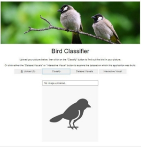	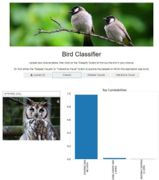

*Figure* *71* *No* *valid* *image* *was* *uploaded.*	*Figure* *72* *A* *valid* *image* *was* *uploaded* *and* *classified.*

The function classify() takes the path to the resized user image and applies the batchify() function to it (see figure 24). Then it lets the model predict the probabilities that the bird in the picture belongs to each of the 450 labels and returns those probabilities.

*Figure* *73* *The* *function* *classify().*

The create\_bar\_chart() function takes a list of the top 3 probabilities and the corresponding labels. It concatenates the probabilities in percentage format to the labels so they can be displayed on the x-axis. Then it creates a bar chart that displays the top 3 predicted probabilities for the user image. It saves it, then reopens it, loads it into an Image widget, and returns this widget.

55

Section D  56	

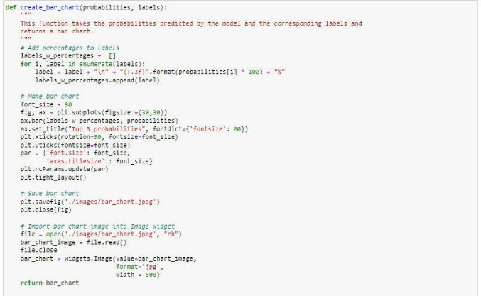

*Figure* *74* *The* *function* *create\_bar\_chart().*

Dataset Visuals Button

The “Dataset Visuals” button displays the two static visuals that we created in the Visualization notebook: the barplot showing the number of images per species and the scatter plot showing the total number of images per family.

The function that gets triggered when the user clicks the button is called on\_visuals\_button\_clicked(). It starts by clearing out any previous outputs from the output box. Then it reads in the first visual (bar plot). We use the HTML widget to write a formatted explanation of the visual and add the image to an Image widget. The text and the image are then combined into a VBox.

We do the same thing for the second visual. Then we combine the two visuals into the outbox and display it (see figure 79).

56

Section D  57	

*Figure* *75* *The* *function* *on\_visuals\_button\_clicked().*

57

Section D  58	

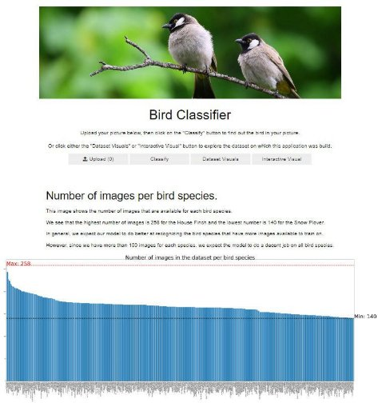

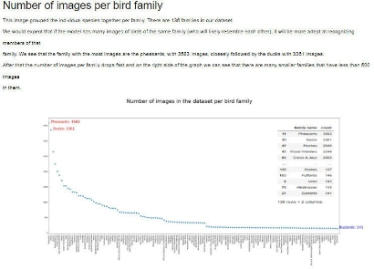

*Figure* *76* *Two* *static* *visuals.*

58

Section D  59	

Interactive Visual Button

The last button on the dashboard is the “Interactive Visual” Button, which will display the third visual based on the dataset, the average RGB values for each image belonging to a chosen bird family.

The function behind this button is on\_interactive\_button\_clicked(). Just like the other buttons, it starts with clearing any previous outputs. Then it creates a Dropdown widget that allows the user to choose any of the 136 bird families (see figure 81). By default, the widget is set to Ducks.

An interactive widget then passes the selection in the dropdown widget to the family\_select() function (see figure 82). This function will create and return the 3D scatter plot, which is then displayed in the outbox.

*Figure* *77* *The* *function* *on\_interactive\_button\_clicked().*

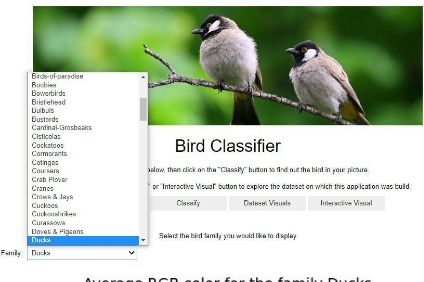

*Figure* *78* *Family* *dropdown* *widget.*

59

Section D  60	

The family\_select() function takes the selected family and calls the colored\_scatter() function to create and save the 3D scatter plot for that family. We have discussed the colored\_scatter() function in the visualization notebook (see figure 59).

The 3D scatter plot is then read and loaded into an Image widget, which is wrapped into a Vbox and displayed.

*Figure* *79* *The* *family\_select()* *function.*

60

Section D  61	

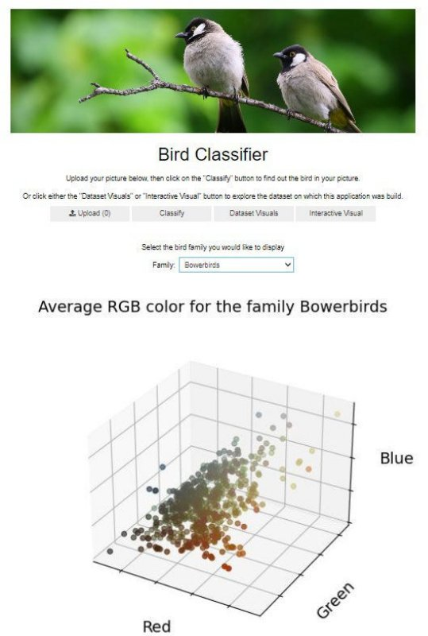

*Figure* *80* *Interactive* *Visual.*

61

Section D

Voila

**All the widgets that are used and displayed in this notebook can be displayed as web-application by using the voila library for jupyter notebooks. By clicking the button in the top corner, the notebook is displayed** in **a separate tab.**

63

;:; JUpyter User\_lnterface\_Heroku lastCh,ckpo"11.2hours ago (aulosaved)

F e	Edit	View	Insert	Cell	Keme-J	WicJget:s

*Figure 81 The voilabutton.*

\_, ,  .....\_

Bird Classlfler

....\_'"')'\_..,.....	... \_

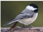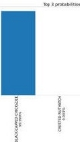

*Figure 82 Web-application view.*



logout

IPython 3 (ipy emel) 0

Heroku

**For the application to run on Heroku, we need three configuration files. In the Procfile file, we specify that our application is a web application and that we want voila to automatically open our notebook**

**when the application is started so that we see the same dashboard-style**

**application.**

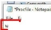it Format 1/iew Help

web: voila --port=$PORT --Voila.ip=0.0.0

--no-browser --enable\_nbextensions=True

*Figure 83 Procfi/e*



hitelist="[ '\*.jpg', '\*.hS', '\*.csv' )"

The requirements.txt file specifies the libraries needed for Heroku to build the environment in which the application runs. We specify specifically that we want the CPU-only version of TensorFlow (not the GPU­ enabled version) to save memory.

.JI requirements - Notepad

File  Edit	Format  View  Help

numpy==1.21.5 pandas==1.3.5 matplotlib==3.5.2 ipywidgets==7.6.5 voila==0.3.6 tensorflow-cpu==2.9.0 IPython==7.31.1 tensorflow-hub
c

P

*Figure 84 Requirements.txt file.*

The runtime.txt file specifies the version of python used for the application.

'.] runtime - Notepad

File  Edit  Format	View	Help

python-3.10.8
c

*Figure 85 The runtime.txt file.*

1. Hypothesis verification

We hypothesized that we can train a CNN model so that it will accurately(> 90%) classify bird images into 450 different species.
|Loss|Accuracy|Precision	Recall|
| -: | -: | :-: |
|ResNet	0.509602|0\.909778|0\.915398 0.908889|

As we have seen when we compared the metrics of the three models (ResNet, MobileNet, and EfficientNet), all three manage to have an accuracy of over 90% on the test dataset, so we accept our hypothesis. MobileNet has the highest accuracy, with 95.42%, and is chosen for our application.

**MobileNet**	0.208484	0.954222	0.957942	0.951556

EfficientNet	0.407527	0.928000	0.932499	0.927111

*Figure 41 (repeated, cropped) Comparison of the three models.*

Our application was meant to be an easily accessible, easy-to-use web application. By the use of a simple interface that can be accessed by the users in their own web browser, we have succeeded in this goal.

Section D  64	

1. ##### Effective Visualizations and Reporting
Our notebooks, most notably the Visualizations notebook, contain multiple graphics and visuals that give a better insight into our dataset.

One of the easiest ways of visualizing a dataset containing images is to simply display some of these images, along with their label. We can immediately see that these images are cropped in such a way that the birds are front and center, in close-up. This will help the model recognize the birds better in similar photos, but it might make it harder for the model to recognize birds in pictures where the bird is less prominently displayed. Users might get a better result if they crop their picture to have as many of the pixels belonging to the actual bird.

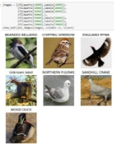We can also see that some of these pictures have artifacts in them, like the watermark on the picture of the African Oyster Catcher.

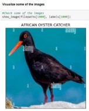

*Figure* *44* *(repeated)* *Visualization* *of* *a* *single* *image.*	*Figure* *45* *(repeated)* *Visualization* *of* *multiple* *images.*

Next, we can explore the balance of the different classes (bird species) in the dataset. If a particular species has significantly more images than others, the model might be imbalanced in a way such that it is much more accurate in predicting this species. These species with a lot of images may skew the reported accuracy.

First, we summarize this in table form (abbreviated to only show the head and tail of the dataframe), then we create a bar plot of the number of images per bird species. As we can see, the total number of images in the dataset range between 258 images for the house finch, and 140 images for the Patagonia Sierra finch, the red-tailed thrush, and the snowy plover. However, as we can see in the bar plot, the classes with a lot of images are few in number and most species have more or less the same number of images.

*Figure* *49* *(repeated).* *The* *number* *of* *images* *in* *the* *whole* *dataset.*

64

Section D  65	

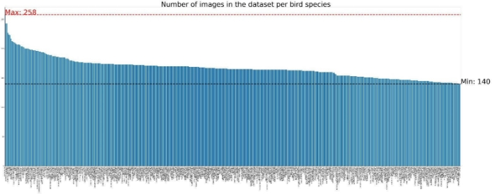

*Figure* *51* *(repeated)* *Bar* *plot* *of* *images* *per* *species.*

Another way of looking at this is by grouping the species per family. The idea is that the model will most likely confuse a species with other members of their family since birds belonging to the same family are likely to have similar appearances.

Again, we can first summarize this in a dataframe, from which we can see that the most populous families are the pheasants and the ducks, each with more than 3000 images. Some of the families with much fewer images are the albatrosses and the bustards. It is worth noting that one of the reasons for this could be that there simply are more species in the pheasant family than in the bustard family. Still, we expect our model to be able to recognize families with more images better than those with fewer images.

When we look at these numbers in a scatter plot, we can see some families with a very large number of images, and a long tail of families with relatively fewer images.

*Figure* *52* *(repeated,* *cropped)* *Count* *the* *number* *of* *images* *per* *family.*

65

Section D

Number of images in the dataset per bird family

Ph<4sani.; 3583

- **Ducks: 3361**

..........

·······.····.············.......

- • • • • • • • •• ••• •• • •• •••• ••••••••••••••• ••• ••••••• ••••••••••••••• **Bustards: 141**

*Figure 55 (repeated) Scatter plot displaying the number of images perbird family.*

One of the ways bird species differ from one another is their coloration and this is likely an important feature on which our model classifies images. We can visualize this diversity in coloration by taking the average values of the RGB values for each pixel in the image. Color in images is defined by 3 color values for each pixel, which together make up one color. For example, a pixel with an RGB value of RGB(0,128,128) means that the pixel has a red value of O (out of a max of 255), a green value of 128, and a blue value of 128. Together, that gives the color teal.

For each image, we took the average of the RGB values (separate per color channel) over all the pixels, then we plotted each image of a certain family on a 3D scatter plot, so we can see the variation of color within the images of that family as well as differences between families.

For example, we can see that the leafbirds are greener, while the flamingos are reddish. The points in the leafbirds plot are more scattered, while the ones in the flamingo family are more clustered together.

Average RGB color for the family Leafbirds	Average RGB color for the family Flamingos

Blue



Blue

Red	Red

*Figure 61 (repeated) Plot of average RGB values of leafbirds.	Figure 62 (repeated) Plot of average RGB values of flamingos.*

**66**

Section D  67	

When the application classifies a user image, it shows the image uploaded by the user, the predicted label, and a bar plot of the top 3 probabilities for its label. This can help the user determine how sure the model is in determining the species.

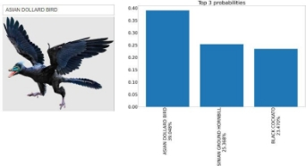For example, the model is pretty sure this is a striped owl, but it’s not sure about this Archeopetryx at all.

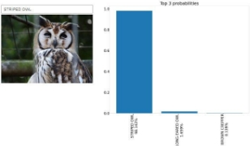

*Figure* *86* *Top* *3* *probabilities* *comparison*

1. ##### Accuracy analysis
The accuracy of the model was assessed in two ways. First, we looked at the accuracy of the model on the validation data. We can do this by viewing the TensorBoard, which shows the accuracy of the model after each epoch. We see that the MobileNet accuracy reaches 93% after 8 epochs.

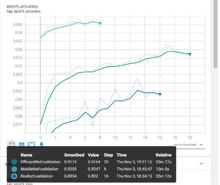

*Figure* *33* *(repeated,* *cropped)* *Accuracy* *for* *the* *three* *models.*

67

Section D  68	

While we are mainly interested in the model’s accuracy, it is a good idea to look at some of the other metrics as well.

Our model has a loss of 0.27 at the end of the training, which was better than both other models.

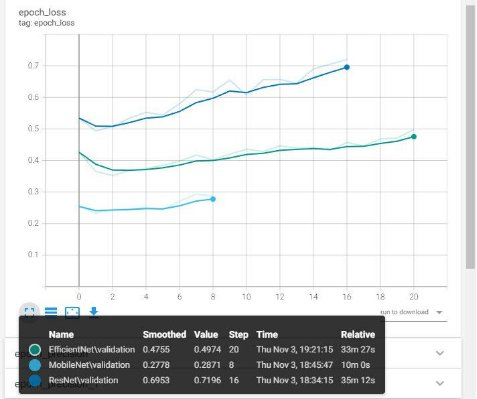

*Figure* *34* *(repeated)* *Loss* *for* *the* *three* *models.*

MobileNet has a final precision of 94%, and a recall of 93%, both of which are relatively good, and better than the scores of the other two models we tried.

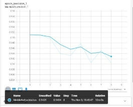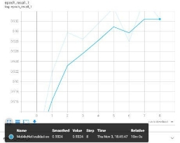

*Figure* *36* *(repeated)* *Precision* *of* *MobileNet.*	*Figure* *39* *(repeated)* *Recall* *of* *MobileNet.*

68

Section D

Secondly, we can evaluate the accuracy of the model on the test dataset as well. We see that our model does relatively well here too. It reaches an accuracy of 95.42%, a loss of 0.21, a precision of 95.79%, and a recallof 95.15%. Again, the MobileNet performed best of all three models.

||loss|Aoc.1racy;|Preci1si1on|Recall|
| :- | -: | -: | :- | -: |
|ResNet|0\.509602|0Ji09778|0\.1915398|0\.90&889|
|Mo bmleNet|0\.208484|OJ}541222.|l)Ji57'942'.|(l 951556|
|Efficie1i11tNet	0.407527	OJJ28000	lJ.'932499	0.927111|

*Figure 41 (repeated, cropped) Comparison of the three models.*

1. Application Testing

We used three different levels of testing for this application: Unit testing, Integration testing, and Acceptance testing.

69

Acceptance testing was performed by the end customer,  application met their goals and requirements.

We did unit testing on each part of the application: Classifying functionality

Static visuals Interactive visual

Overallapplication (title, banner, buttons)

They determined that the

Unit testing encompassed going through the code line by line, ensuring no inconsistencies or mistakes were present in the code. Then we tested the functionality by trying out different user cases·including situations where we expect our model to fail - such as feeding the model a correctly formatted image, and an incorrectly formatted image, not feeding it any image at all, feeding it an image of something entirely different, etc.

One problem we encountered while unit testing was that the application crashed if no image was uploaded before the user clicked the "Classify'' button. Since the uploader widget did not throw an exception when trying to access an uploaded image when none was uploaded, we had to manually check whether an image was present or not. This also included resetting the image at the start of the function.

Section D

#### # *Reset i.mg and img\_r-esized*
img = **None**

img\_resized = **None**

#### # *Read uploader*
**for**	name,  file\_info **in** uploader.value ..items():
#### # *Read image from uploaderJ resize it and save as jpg*
img  *=*      Image.open(BytesIO(file\_info['content']))

im>

***P  Cbe;hfhat** some-thing, •as uploaded*

**1** if 
#### # *Save user image*
##### img\_iresized  = imgr.esize({IMG\_SIZE,If"'.G\_SIZE))
img\_resized.save("./images/user\_image\_resi-zed.jpg")

*Figure 87 Manually check for the uploaded image.*

We also performed integration testing to assure that all units integrate well together. For example, we realized that we needed to clear out the outbox manually every time we went from one button to another, otherwise the previous output would still be visual underneath the new output.

# *Clear previous output*

**global** outbox **global** visual\_3 outbox.cli0se() visual\_3,.close{)

*Figure 88 Clearing previous output.*

70

Section D

A\.'erage RGB color for the family Ducks

*t*

I

Slue

..........

*-/*

-------	··of'.	.,,,.

Red  ----.	*</"*
Output of "Display Visuals"

         Output of "Interactive Visual"

*Figure 89 Old output persists when changing buttons.*

1. Security Measures and Maintenance

This application does not warrant a user login or encryption of data. No sensitive or private information is stored or provided by the application. To protect the application from attacks, we specify a specific format of files that are whitelisted by the application. This is done in the Procfile, needed by Heroku.

Any formats other than the ones specified will not be trusted by the application.

.l \*Prodile- Note.pad

·  File Edit F0<mat View Help	,, 	

,	web: voila --port=$PORT --Voila. ip=0. 0.0 hitelist=" ['\*.jpg',  '\*.hS',  '\*.csv' J"I

--no-browser  --enable\_nbextensions=True----

*Figure 86 (repeated) Procfi/e*

73

Heroku, as a Paa$ service, also provides a long list of security measures for their systems, protecting their own systems as well as the applications running on them. These measures can be viewed here: [https:ljwww.heroku.com/policy/security](http://www.heroku.com/policy/security) (Heroku, 2022).

Heroku also provides logs, which allow us to check up on the application and any problems it might encounter.

###### ` `I"'°'.;I
IL\(-	 I

A \"-.ww«>l'IOC>o.i

.\p,plic.a'Sonlnp

2(1ll II .,r.,a:1\'l."979'S•OO•IM IIOCl:..tt.l)! ('loH•) St !111 .., !11, '«' 4!\'lccSW:-!$$6,,kt '8a4 8'0(6 9'ft:, ld "3<f.4UJ.l>'Ji84• 39oi:k7'-•S

;1(1)>.n.-.o• ,.,11.41MIM IICI·• · •-·· tJl ( H•J (4,..,.,.) •....,.\_, d ««11.;,t=,(,••	u,U,.« u

20 •	T lt.t,4•q,i,<	: •l•h'<> IK't. ..f()St P•Vl•'/·,o!!•( J.b.\_,t,,\_,'62t(d'4 !"64%n• • i)«s« ..•  ..Mfr>J<H ♦;»

re .t\_iO,,♦Uo)ff,s•ns.- -6m•lold9'4H1"' Ac-•t&&.96.!t.n• yi,o-,.1 CV'">t(t..W Sffll!Ct ..?	$t4o:<.1$•M' l:,,ftU"iA' Ol"<t«o:•tttt>S

1t:(J•ll••u1·,o,.. \_,  	ro.-,,i"".)1- 101tl'tc

,1.,...

]Ul ll·MU:t4}:'84$21U6<00:• "Cf'Olti,{ b-.1). Sutt C I '  ,o t - "''l•ll•!Ml):,,11.la nn1>-1K1, -...........,-1>.t), 'tt,)9(11,,,1 .u ,..........., .., IC.1':i,t

:en!l N.U!,l!-,S,"Ml'1•e&·tt ••,, .....l); f'toO•) '<>M'lc	1 u.

l9U·ll·KUl;4):♦1 )Mi? ;- "U0<11tooet>,l!; *tr«ta* o:htO 'lllt'" H• s &

)OJ•ll•lllll, ·••,1'•..,...,.,Wf'l)lwi.,,,ft.1; St•l'lll\1 po'61'H .,1111 ,  . ..db ••J#'l--oOlll ••'ltll•.1p•.•···· ••llt)1l.C•••r""'•tlt11.ti1	,u..1i<r•·,·•.j"', ·•.M·,

'".<VI"]• ••'IO• OIIM'f' ••C'l♦tllt 1'Cll!t >1ellf•l  l"St•.) f"'fU ,.-oio,.1 .,.,·

•il-

.Nll·lHM>UZ:J'j;.-11., ;- m: 1.lJ: , ,. · lc,,.Wnflio/o:,t"'0'>),19/dU·c:.& •tn/ rdtlta/tr•i:: tH,()':aH); f..t...-tl,fff,iM• ••\',;l. •Cor.f!f f•t1 .,lltJ'l',htlin•

1·•.'911·, ••.,,,•• ·•. w·) - t;O'>t•into-> I) d<;,t,'o\r<I 1.. t<•ltlrtJ, ,.e.Yl:M ·,.p,.o.. ••Y'olt,C-i,1\_1..	f'llc... H(!ht Uf• ••• Klt1Q)( ,,.. >ComidIt""" tel• )\,C,,

lU2•!1·kTl?;)t:fl. 68;et IIPl) M-t.!): .. fl(

n-:i,-♦,sn,l't,,c:.to "  ...• "•'-=-11=flQ))•J JJl,... *Jr.-,* ott tt'S::,,,. tl!•

n.U ll MU!,»i•t.ff,1.1$6•00•19 apc,:'-f't-11:S:,J t ,1,., <O <tt<M'I !!o it1/t•/vdlf.,l,'14;r}.

2'lll·ll·hln:19;•\.fr94.N)-08;0f : ..N,1); t lt•Jk.-.•lrc ,htk,11ti fr09 lt,;.+/,llf 1(,:IO)' hotllllWpyttmJ.101sltt·UelllttS/1oiJ,-Js:•th,

ion II Ul.tt .• ....H-.C,(IO.oe\_, .... -l1; ('!l;,H•J-t<>l?f h .--i.	,.

l,;'lll•lS•kTU;)t;.12 •sut,a6;• lll)Cl(ION.I): Mto:lltlM-t1&1.·... c.1• 9b•t. •Hl>!l :•2-1>1

1U1•1l•lli01:tl,l ,4 1 ....:M•M>t"!IOl'l>,l1 $htt ......... ,,\_ ,t.l'th't to

2,)}l 11MU!:Yl•Ull42UE--001N.(o1tt.lJ: C\04•) lll'tttl'C "'ft lt•dc•111. tll',> t l•t-,1.:«dls-•	,1,1.1oyt,-111oteoo1C\_$Kf'll't

n21.:1-1M-111,)l),+1.i'6.lWl..iQ,W !Ifft-,1): (16H•J ...AANIN(I I -.o-t u-Jn.tvf.-;tc,..wf'Ol<v,f1>y,,e. 1 ,,,.t t,.-ct

:ou U 60-f,H->t,"' ..,. 1.., .0♦,M •w:ffl.. 11, 1l♦) (.., .. )t..., , •><iNt: a	*.<t'U* • h  ,t,..7	U)II

*Figure 90 Heroku logs.*

1. Application Files

The project includes the following files:

Name	Description

<table><tr><th colspan="1" rowspan="3" valign="top">
Application documents

MobileNet.hS
</th><th colspan="1" valign="top">These documents are uploaded to Heroku as part of the application</th></tr>
<tr><td colspan="1" valign="top">The jupyter notebook in which the application is built.</td></tr>
<tr><td colspan="1" valign="top">The trained model</td></tr>
<tr><td colspan="1" valign="top">bird_rgb.csv</td><td colspan="1" valign="top">
A CSV list of the average RGB values of all images and the family they

belong to.
</td></tr>
<tr><td colspan="1" valign="top">unique_labels.csv</td><td colspan="1" valign="top">CSV file listing all 450 bird species</td></tr>
<tr><td colspan="1" valign="top">unique_families.csv</td><td colspan="1" valign="top">CSV file listing all 136 bird families</td></tr>
<tr><td colspan="1" valign="top">Procfile</td><td colspan="1" valign="top">Configuration file for Heroku</td></tr>
<tr><td colspan="1" valign="top">
requirements.t>ct

runtime.txt
</td><td colspan="1" valign="top">
Environment requirements needed to build the application on Heroku

Specifies the python version the application runs on
</td></tr>
<tr><td colspan="2" valign="top">
Folder "imag'e-s"-----------C-o-n-ta-in-s a-ll-im-a-g-es'needed by the application

banner.jpg	Banner on top of the application
</td></tr>
<tr><td colspan="1" valign="top">bar_chart.jpg</td><td colspan="1" valign="top">Top 3 probabilities bar chart (gets overwritten)</td></tr>
<tr><td colspan="1" valign="top">colored_scatter.jpg</td><td colspan="1" valign="top">3D scatter chart (gets overwritten)</td></tr>
</table>

|species bar plot.jpg|Bar plot of the number of images per bird species (visual 1)|
| :- | :- |
|families scatter plot.jpg|Scatter plot of the number of **images** per bird family (visual 2)|
|
`	`placeholder.jpg	

user image resized.jpg
|
Placeholder image for when no valid image was uploaded

The image that holds the user image for display (gets overwritten)
|
||
|**Supporting documents**|
These documents are not uploaded as part of the application but were

used in the development of the application.
|
|birds.CSV|
CSV file that wasincluded in the dataset, listing all images with their

filepaths, labels, scientific labels, and which dataset they belong to (train, test, validation)
|
|bird\_species\_list.CSV|
CSV file containing all bird families, with their common name, the genera

and the species that belong to that family, and their common names.
|
|Model training.ipynb|Jupyter notebook that was used to train the model(s).|
|Visualization.ipynb|Jupyter notebook that was used to visualize the data|
|Folder "logs"|
The folder holding the logs for model training. This is used by the tensorboard to visualize the training process and the associated metrics. It has a subfolder for each training event (here: for each of the three models), each containing subfolders for training metrics and validation

metrics.
|
|Folder "models"|The folder holding the trained models.|
|EfficientNet.hS|Trained EfficientNet model|
|(MobileNet.hS)|Trained MobileNet model, used in (and moved to) application documents|
|ResNet.hS|Trained ResNet model|
|Folder "test images"|Folder containing several images to test the application|
||
|**Environments\***|
These files can be used to recreate the environments used to develop the

application. They are in yml format.
|
|env.yml|The environment used for the Model training notebook|
|env\_plt.yml|The environment used for the User Interface and the Visualizations notebooks. Can also be used to open the Model training notebook, if no actual model training will be done.|

\*: Heroku builds the required environment for the application to run automatically, based on the requirements.txt document. The two provided yml files are not necessary to run the application, but they might be useful to open the notebooks used for development if desired. They can be used by running the conda command:

*condo env create -f env.yml*

Note: Because the dataset is too large (>2GB), we did not include it here. Thedataset can be accessed at

(Piosenka, 2022). We did include the

bird.csv file that accompanied the dataset and has all filepaths.

Section D  74	

1. ##### User’s Guide
The application is hosted online at the following address:	No installation is needed.

1. Click	or paste this address in the browser address bar:

Because the application is quite large and we use the free version, it is possible that on rare occasions, Heroku hangs. Simply refresh the page or click the link again.

1. To classify an image of a bird:
   1. Have an image of a bird you like to classify ready on your computer. It will need to be in jpg or jpeg format.
   1. Click the “Upload” button.
   1. Browse to the image on your computer. For the sake of convenience, several testing images were provided in the submission, but any image of a bird will do.
   1. Click “Open”.
   1. Click “Classify”.
1. To see the static visuals:
   1. Click “Dataset Visuals”.
   1. Scroll down to see the second visual.
1. To see the interactive visual:
   1. Click “Interactive Visual”.
   1. In the dropdown menu, select a family you would like the view.

1. ##### Summation of Learning Experience
This project was my first hands-on machine learning and web application development experience, having no professional experience in the field of computer science yet. Therefore, I was largely unfamiliar with virtually all the tools required for it, such as Jupyter notebooks, NumPy, pandas, matplotlib, TensorFlow, voila, and Heroku. However, many resources for self-teaching are available online, such as video courses, user guides, and documentation, and I managed to acquire the necessary knowledge to successfully finish the project successfully. I am confident that the knowledge I gained as well as the skill in knowing how to look for and where to find the needed information, will be very useful in my later career.

74

Section E  75	

## Section E
### Citations

Boyd, J. H. (2019, July 27). *Taxonomy* *in* *flux* *checklist* *3.08*. Taxonomy in Flux Checklist: Version 3.08.

Retrieved November 6, 2022, from <http://jboyd.net/Taxo/List.html>

He, K., Zhang, X., Ren, S., & Sun, J. (2015). Deep Residual Learning for Image Recognition. *arXiv*. https://doi.org/10.48550/arXiv.1512.03385

Heroku. (2022). *Heroku* *security*. Heroku. Retrieved November 6, 2022, from https://[www.heroku.com/policy/security](http://www.heroku.com/policy/security)

Heroku. (2022). *Platform* *as* *a* *Service*. Heroku. Retrieved November 6, 2022, from https://[www.heroku.com/platform](http://www.heroku.com/platform)

Howard, A., Sandler, M., Chu, G., Chen, L., Chen, B., Tan, M., Wang, W., Zhu, Y., Pang, R., Vasudevan, V., Le, Q. V., & Adam, H. (2019). Searching for MobileNetV3. *arXiv*. https://doi.org/10.48550/arXiv.1905.02244

Piosenka, G. (Updated 2022, October). Kaggle: Birds 450 species - Image classification. Retrieved November 6, 2022, from

Russakovsky, O., Deng, J., Su, H. et al. (2015). ImageNet Large Scale Visual Recognition Challenge. *Int* *J* *Comput* *Vis* **115**, 211–252 (2015). https://doi.org/10.1007/s11263-015-0816-y

Tan, M., & Le, Q. V. (2021). EfficientNetV2: Smaller Models and Faster Training. *arXiv*. https://doi.org/10.48550/arXiv.2104.00298
75

